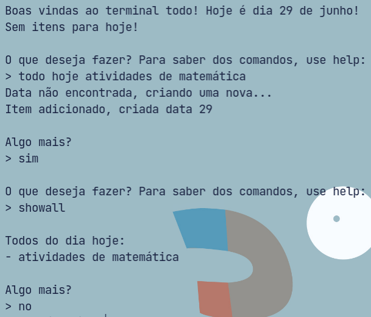
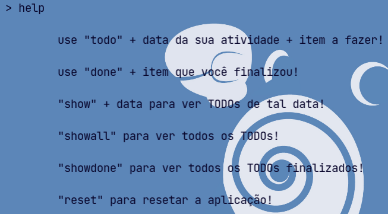
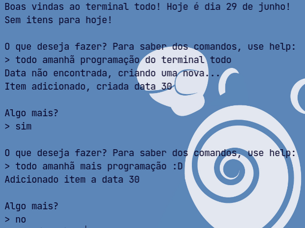
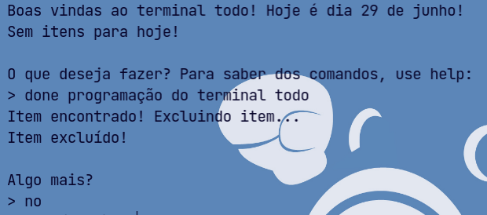
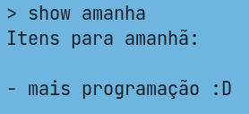
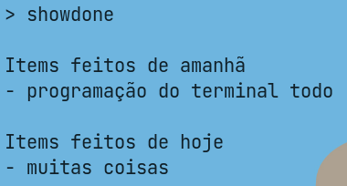
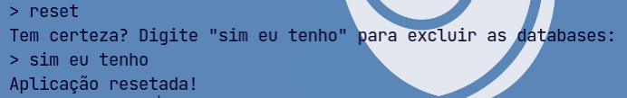

# Terminal To-do
Boas vindas ao Terminal To-do, meu aplicativo escrito em Python e SQLite para organização de tarefas!



## Instalação
### Linux e macOS:
```sh
git clone https://github.com/jettsteel/terminal-todo
cd terminal-todo/src
chmod +x todo
```
Para executar, use o seguinte comando:
```
todo
```

### Windows:
Apenas vá para releases e baixe o arquivo `todo.exe`.

## Sigam o tutorial abaixo para aprender os comandos:
### help

O comando `help` basicamente mostra todos os comandos, para fácil e rápida consulta!
```
> help
```

### todo

O comando todo é, sem dúvidas, a base do projeto. Com ele, é possível adicionar itens a datas específicas ou criar novas datas.
```
command data item
> todo hoje criar uma saga!
```

### done

O comando `done` é outro comando muito importante: com ele que você finaliza as tarefas e sente aquela boa sensação de realização. Os itens são excluídos da database principal, mas são adicionados a outra database justamente para caso você precise consultá-los depois.
```
done item
> done programação
```

### show e showall
Os comandos `show` e `showall` possuem o mesmo objetivo: mostrar os TODOs. A única diferença é que o `show` precisa de um argumento: a data para ver os itens daquele dia.
```
show data
> show hoje
```

```
> showall
```


### showdone

O comando `showdone` é similar ao `showall`, com a diferença dele mostrar os itens finalizados, não os TODOs.
```
> showdone
```

### reset

O comando `reset` **exclui todos os bancos de dados (as databases), use-o com precaução**.
```
> reset 
> sim eu tenho
```

## Conclusão
Bom, é isso, espero que meu pequeno app te ajude! Boa sorte!